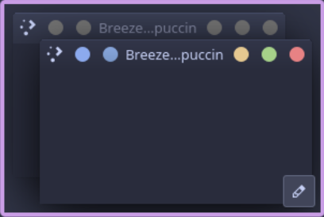
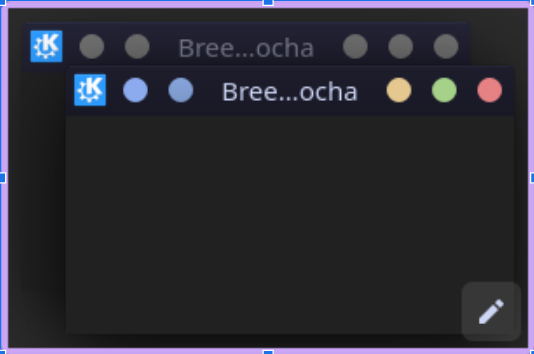

<h3 align="center">
	<br/>
	
	Catppuccin for <a href="https://github.com/tsujan/BreezeEnhanced">Breeze Enhanced</a>
	
</h3>

<p align="center">
	<a href="https://github.com/arithefirst/BreezeEnhancedCatppuccin/stargazers"></a>
	<a href="https://github.com/arithefirst/BreezeEnhancedCatppuccin/issues"></a>
	<a href="https://github.com/arithefirst/BreezeEnhancedCatppuccin/contributors"></a>
</p>

<p align="center">
	
</p>

## Previews

<details>
<summary>🌻 Latte</summary>

</details>
<details>
<summary>🪴 Frappé</summary>

</details>
<details>
<summary>🌺 Macchiato</summary>

</details>
<details>
<summary>🌿 Mocha</summary>

</details>

## Usage

1. Open a new terminal Window
2. `bash <(curl -s https://raw.githubusercontent.com/arithefirst/BreezeEnhancedCatppuccin/main/build.sh)`

If you Prefer a manual Installation:
1. Clone this repo
2. Enter the cloned directory, then enter the directory of the flavor you want to install
3. Run the following in your terminal
```sh
mkdir build && cd build
cmake .. -DCMAKE_INSTALL_PREFIX=/usr -DCMAKE_BUILD_TYPE=Release -DKDE_INSTALL_LIBDIR=lib -DBUILD_TESTING=OFF -DKDE_INSTALL_USE_QT_SYS_PATHS=ON
make
sudo make install
```

## 💝 Thanks to

- [Tsujan](https://github.com/catppuccin) (Developer of Breeze Enhanced)

&nbsp;

<p align="center">
	
</p>

<p align="center">
	Copyright &copy; 2021-present <a href="https://github.com/catppuccin" target="_blank">Catppuccin Org</a>
</p>

<p align="center">
	<a href="https://github.com/catppuccin/catppuccin/blob/main/LICENSE"></a>
</p>
